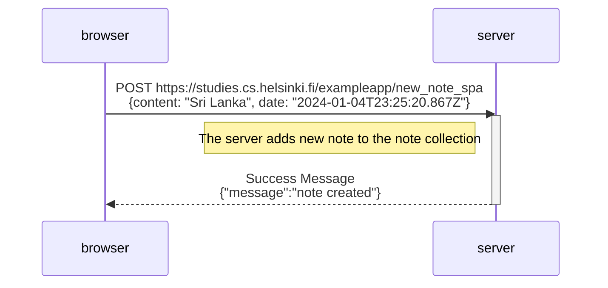

```mermaid
sequenceDiagram;
    participant browser
    participant server

    browser->>server: POST https://studies.cs.helsinki.fi/exampleapp/new_note_spa <br/> {content: "Sri Lanka", date: "2024-01-04T23:25:20.867Z"}
    activate server
    Note left of server: The server adds new note to the note collection 
    server-->>browser: Success Message <br/> {"message":"note created"}
    deactivate server
```
